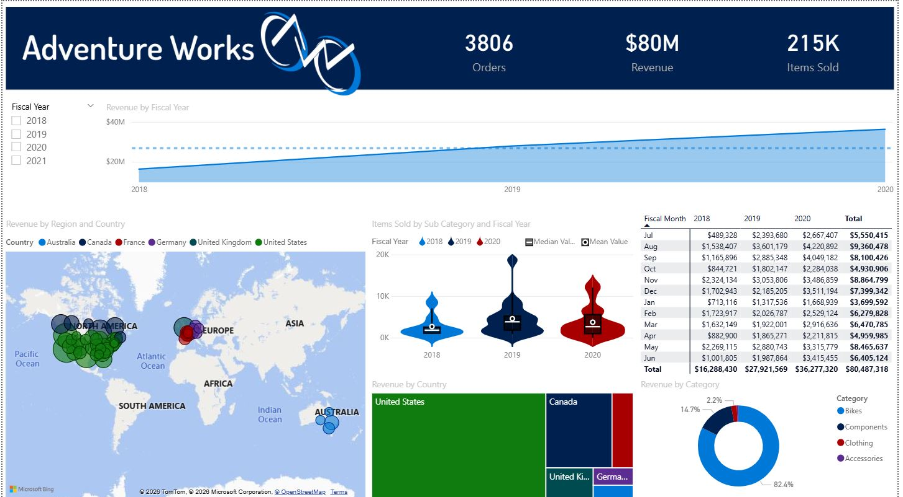
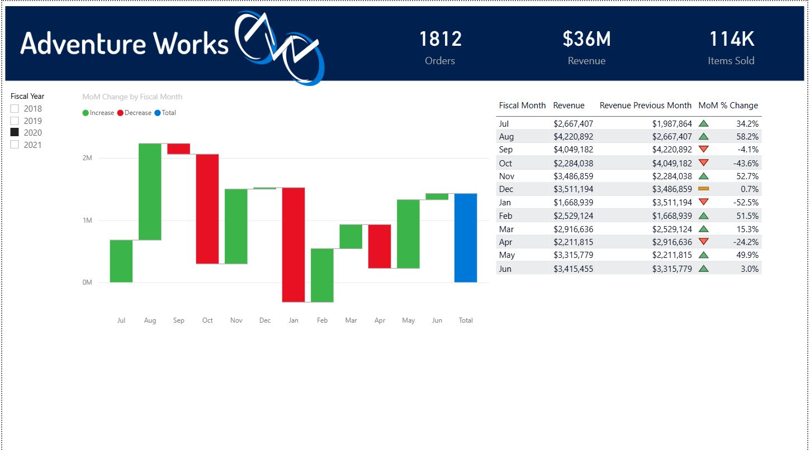
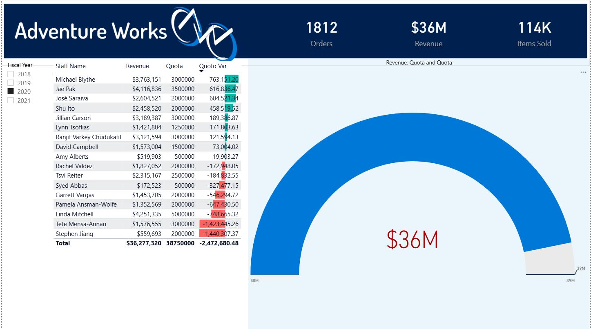

# Sales Performance Dashboard: Revenue vs Quota Analysis (Power BI)

## Dashboard Preview

### Main Dashboard

### Sales Trends

### Quota Analysis

 Overview
This project presents an interactive Power BI dashboard analyzing sales performance against quotas using the Adventure Works dataset.

 Key Features
- Revenue vs Quota comparison
- KPI tracking (Revenue, Orders, Items Sold)
- Fiscal calendar hierarchy (Year, Quarter, Month)
- Staff-level performance analysis
- Conditional formatting (Data Bars)
- Interactive slicers and filters

Tools & Technologies
- Power BI
- DAX
- Power Query
- Data Modeling

## File
Download and open in Power BI Desktop:
- Sales_Report.pbix
